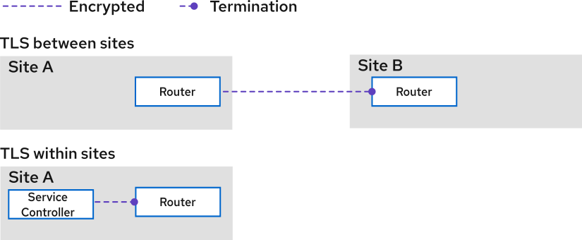

## Using custom certificates for incoming links on Kubernetes

This section describes how to replace the default certificates for Kubernetes sites.

By default, the Skupper controller creates its own Certificate Authority (CA) and self-signed server certificates. 
For example, it generates certificates to authenticate incoming links from other Skupper sites.

The default CA is named `skupper-site-ca`. 
The default server certificate is named `skupper-site-server` and is issued for the public hostname or IP address of the `skupper-router` service, based on the ingress type (for example, OpenShift Route or LoadBalancer).

You can replace these defaults with your own CA or server certificate.

## Mutual TLS between sites

When two Skupper sites are linked, the routers use mutual TLS (mTLS) for authentication. 




The certificates and keys for this process are stored in Kubernetes Secrets:

- **`skupper-site-server`**  
  Contains the key, certificate, and CA certificate used by the `skupper-router` when accepting incoming links from other sites.
- **Client credential Secret**  
  Contains the key, certificate, and CA certificate used by the `skupper-router` when creating outgoing links to other sites. The Secret name is user-defined and referenced in the `Link` resource’s `spec.tlsCredentials` field.

Both routers must trust the peer’s CA and verify that the certificate’s hostname or IP matches the link’s address.

If `skupper-site-server` or the client credential Secret are not provided, Skupper generates them using a self-signed CA stored in the `skupper-site-ca` Secret.

> **Note:** Skupper uses the `skupper-site-ca` Secret only if a custom `skupper-site-server` or client credential Secret is not already present.

### Use a Custom Server Certificate

To use your own server certificate, create a secret named `skupper-site-server` in the namespace of your Skupper site:

```yaml
apiVersion: v1
kind: Secret
metadata:
  name: skupper-site-server
data:
  ca.crt: <base64-ca-cert>
  tls.crt: <base64-server-cert>
  tls.key: <base64-server-key>
```

The certificate in `tls.crt` must be valid for the hostname or IP address used in your `Link` resource. To find this value for an existing site:

```bash
kubectl get site -o json | jq -r .items[].status.endpoints[0].host
```

If the site exists, Skupper detects the secret and stops managing the server certificate. Verify with:

```bash
kubectl get certificate skupper-site-server -o json | jq -r .status.conditions[].message
```

Expected output:
```
Secret exists but is not controlled by skupper
```

---

### Generate a Link for Remote Sites

A **Link** lets a remote Skupper site connect securely to your site (incoming link). A link requires:

- A `Link` resource with your site’s connection details.
- A client certificate secret (`skupper-link`) that the remote site uses for authentication.

If you provide `skupper-site-ca` to Skupper, it can create the client certificate secret for you. Example:

```bash
kubectl create -f - <<EOF
apiVersion: skupper.io/v2alpha1
kind: Certificate
metadata:
  name: skupper-link
spec:
  ca: skupper-site-ca
  client: true
  subject: skupper.public.host
EOF
```

---

### Create the Link

You can create a link in three ways:

**1. Skupper CLI**
- Auto-generate (when CA is available):
  ```bash
  skupper link generate
  ```
- Use existing secret:
  ```bash
  skupper link generate --tls-credentials skupper-link
  ```
- Provide your own secret:
  ```bash
  skupper link generate --generate-credential=false --tls-credentials=skupper-link
  ```

**2. kubectl**
Extract endpoints and create the `Link` YAML, then append the client secret.

**3. Manual**
Get endpoints:
```bash
kubectl get site -o yaml | yq -y .items[].status.endpoints
```
Write a YAML file containing both the `Link` resource and the client secret.

---

**Key points:**
- Replace default certs to use your own trust setup.
- Ensure hostname/IP in cert matches your site’s public address.
- Links are for remote sites to connect **to** your site.
