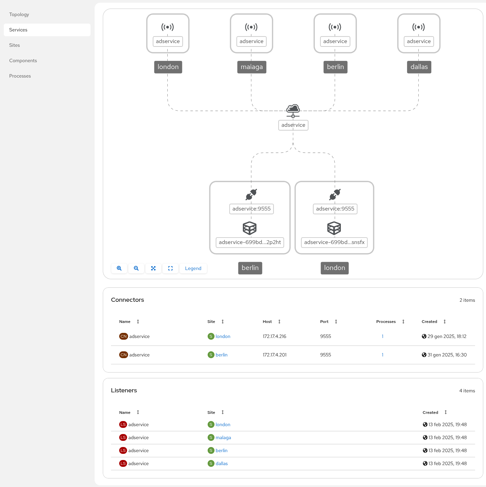

# Using the Network console

The Network console provides data and visualizations of the traffic flow between sites.

## Enabling the Network console

.Prerequisites

* A Kubernetes site


.Procedure

1. Determine which site in your network is best to enable the Network console using the following criteria:

   * Does the service network cross a firewall? For example, if you want the console to be available only inside the firewall, you need to locate the Network console on a site inside the firewall.
   * Is there a site that processes more traffic than other sites? For example, if you have a frontend component that calls a set of services from other sites, it might make sense to locate the Network console on that site to minimize data traffic.
   * Is there a site with more or cheaper resources that you want to use? For example, if you have two sites, A and B, and resources are more expensive on site A, you might want to locate the Network console on site B.

2. Change context to a site namespace.

3. Deploy the network observer helm chart:
   ```
   helm install skupper-network-observer oci://quay.io/skupper/helm/network-observer --version {{skupper_cli_version}}
   ```
4. Expose the `skupper-network-observer` service to make the Network console available, for example on OpenShift:

   ```
   oc expose skupper-network-observer
   ```
## Exploring the Skupper console

The Network console provides an overview of the following:

* Topology
* Services
* Sites
* Components
* Processes

For example, consider the following service:



